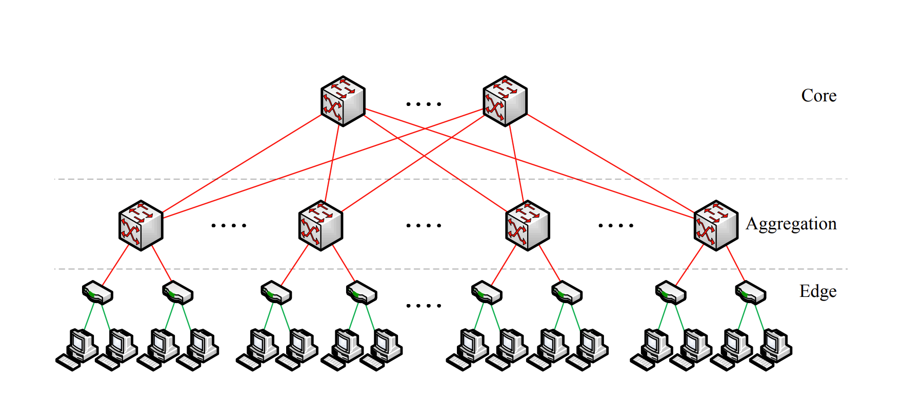
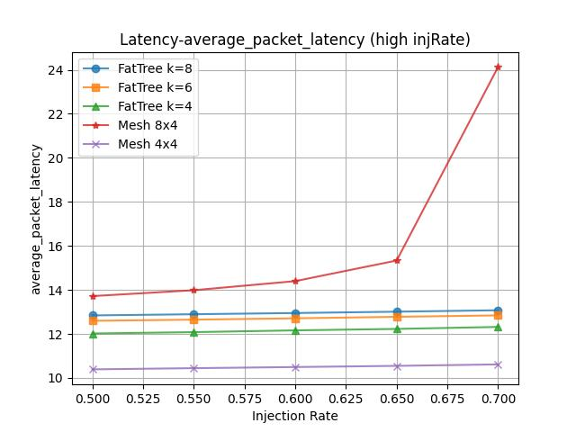
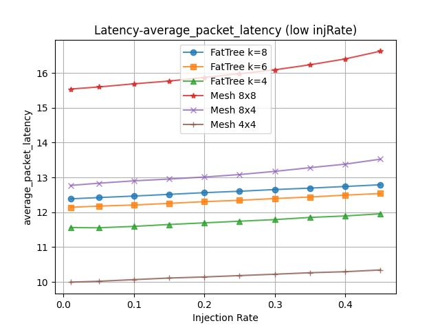
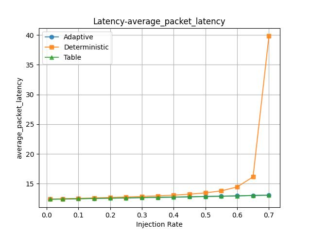
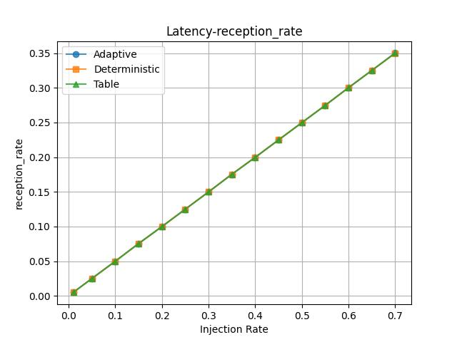

# Adaptive FatTree

>  **To reproduce the results, run command 'python LT_curve_gather.py' under directory 'gem5'.**
>
>  **Slides link: https://www.overleaf.com/read/nnqpvttntkjs#180ac5**
>
>  The NoC project for course 'AI+X Computing Acceleration: From Algorithms Development, Analysis, to Deployment'
>
>  By Xinghan Li & Bowen Yang, IIIS, THU

## 1 Topology

- We implement the "FatTree" topology of the network as mentioned in the paper http://ccr.sigcomm.org/online/files/p63-alfares.pdf. 
- FatTree topology is composed of three layers of routers, called edge layer, aggregation layer and core layer from the bottom to the top. These three layers are connected like a tree topology, except for the multiple core routers as "roots" and multiple links between layers.
- 

- All hosts are linked to routers in the edge layer. In the edge and aggregation layers, the routers are organized in groups called "pod". Between hosts in the same pod, communications start from source edge layer, pass through aggregation layer, and end at destination edge layer. Between hosts in two different pods, communications start from source edge layer, pass through source aggregation layer, core layer, and destination aggregation layer, and end at destination edge layer. 

## 2 Implementation

### 2.1 FatTree Topology

- Edge and aggregation layers communicates with their corresponding hosts locally, and are organized in pod structures. Core layer is designed to switch packets across different pods. The number of pods $k$ is the key parameter that decides the size of the whole network.  The number of routers are:
  - Each pod contains $\frac{k}{2}$ edge routers, so totally $k\times \frac{k}{2}$ edge routers in the whole network.
  - Each pod contains $\frac{k}{2}$ aggregation routers, so totally $k\times \frac{k}{2}$ aggregation routers in the whole network. 
  - The whole network contains $(\frac{k}{2})^2$ core routers in total. There are two types of internal links in total: 
  - One edge router links to one aggregation router in the same pod. The number of links of this type is $k\times\frac{k}{2}\times\frac{k}{2}$. 
  - Each core router has its "agg-link index" (from $0$ to $\frac{k}{2}-1$). Each "agg-link index" maps to $\frac{k}{2}$ core routers. One core router links to the router with the corresponding index in each pod. The number of links of this type is $(\frac{k}{2})^2\times k$.
- Hence there are totally $\frac{5}{4}k^2$ routers and $\frac{1}{2}k^3$ internal links in the whole network. Besides, to avoid the ambiguity in the deterministic routing algorithm, each edge router is restricted to connect to at most $\frac{k}{2}$ hosts through external links, so there are totally at most $\frac{k^3}{4}$ external links under the deterministic routing setting. We have tested for usual $k$ values for $k=4, 6, 8$.

### 2.2 The Deterministic Routing Algorithm

- The implementation is ``RoutingUnit::outportComputeFatTree()``, and its number when specifying --routing-algorithm is 3.
- Since our network nodes are only the routers in the edge layer, we expect the destination to be in the edge layer. 
- First, we figure out the layer which the current router lies in from ``m_router->get_id()``.
- If the current router lies in the edge layer, we go directly upwards to the corresponding aggregation router, i.e. we choose the port number that coincides with our position in the pod.
- If the current router lies in the aggregation layer, that can be further divided into two cases:
  - If the destination is an edge router in the same pod, then we can hop there and end our transportation.
  - Else, we continue to go directly upwards to the corresponding core router.
- If the current router lies in the core layer, we hop into the pod of that router.

### 2.3 The Adaptive Routing Algorithm

- The implementation is ``RoutingUnit::outportComputeFatTree()``, and its number when specifying --routing-algorithm is 4.
- Note that in the implementation of the deterministic routing there are two steps that can potentially become 'non-deterministic': the two steps we 'go directly upwards'. In fact, in these two cases we have $\frac{k}{2}$ different choices of going upwards, each can validly take us to the final destination within minimal steps.
- So we modified these two steps into an adaptive one. Specifically, we **randomly choose from the least congested choices**. 
- To implement that, we defined the congestion value of a router as the number of packages currently going through that router, kept maintainence of all congestion values in the ``GarnetNetwork`` class, and implemented ``RoutingUnit::chooseLeastCongested`` function to serve as making choices. 

## 3 Evaluation

> **To reproduce the results, run command 'python LT_curve_gather.py' under directory 'gem5'.**
>
> For more detailed results, refer to folder 'Lab4' under directory 'gem5'.

### 3.1 Topology Comparations

- We conducted three sets of experiments using different configurations of Mesh and FatTree topologies (Mesh 4$\times$4, Mesh 8$\times$4, Mesh 8$\times$8, FatTree with pod size 4/6/8. The experiments were designed to measure average packet latency at different injection rates to simulate real-world network traffic conditions.

- |  |  |  |
  | -------------------------------------- | ------------------------------------------------------ | ---------------------------------------------------- |

- The experimental results clearly demonstrate that FatTree topologies excel in **stability and scalability**, particularly under high traffic conditions. Unlike Mesh configurations, which experienced a significant increase in latency with higher injection rates, FatTree maintained lower and more consistent latency levels. This performance advantage is crucial for environments requiring reliable network performance even during peak traffic periods. 

- In conclusion, FatTree's superior handling of dense traffic and its scalability make it a compelling choice for modern network infrastructures. Its consistent performance across varying conditions suggests that it can effectively support the growing demands of data-intensive applications and large-scale network operations.

### 3.2 Routing Comparations

- We conducted experiment using different routing algorithm configurations (vanilla deterministic routing as baseline and adaptive routing). The experiment is designed to verify the efficiency of our adaptive routing algorithm, especially when throughput goes up. As the reception rate curves shows that both increase linearly when injection rate increases, **no serious conjestion occurs** in these settings and our experiment is valid.

- |  |  |
  | ------------------------------------------------------------ | ------------------------------------------------------------ |

- The baseline deterministic routing algorithm is designed as: bijectively map each edge router with a output aggregation router, and map each aggregation router with a core router. Whenever a packet goes up from edge layer to aggregation layer or from aggregation layer to core layer, it will pick the specific mapped outport and ignore other $\frac{k}{2}-1$ outports.

- The experiment results clearly prove that our adaptive routing algorithm **makes a great progress to alleviate the busy network traffic** compared to the deterministic baseline algorithm. The main reason is that our adaptive routing algorithm can choose the most appropriate outport based on the local traffic conditions. This fully exploit the compact internal link structures across layers, avoiding the competition for single deterministic channels.

- In conclusion, our implementation of the adaptive routing algorithm of FatTree successfully leverage its topology design and outperforms baseline algorithm. This enhances the robustness of our network to deal with complex and busy traffic conditions.

## 4 Division of Labor

- Xinghan Li: Implementation of routing algorithm, roughly 50% of report & slides, presentation.
- Bowen Yang: Implementation of topology, conduction of experiments, roughly 50% of report & slides.

